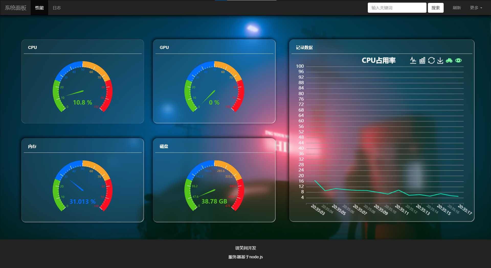

# 系统面板

可以查看cpu、gpu、内存、磁盘的占用情况。

## 使用

#### 1.首先

安装node.js

 [下载 | Node.js 中文网 (nodejs.cn)](https://nodejs.cn/download/) 


#### 2.安装依赖

###### 首先：

在项目的目录下 使用cmd命令行工具：

```
npm i
```

如果安装太慢，就运行下面的：

```
npm config set registry https://registry.npmmirror.com 
```

###### 运行:（按需要选择！）

- 使用的是EventSource(SSE)

```
node server.js
```

​		浏览器打开：http://127.0.0.1:8081/index.html

- 使用的是WebSocket

```
node server2.js
```

​		浏览器打开：http://127.0.0.1:8082/index2.html


## 说明

这只是一个简单dom。

node.js后端，前端借助了EChart图表工具库。

#### 效果：




- 左边四个可以点击选中，选中的可以在右边显示。

    

- 右边这个图：**鼠标放入**，按住  *ctrl+滚轮*  可以放大缩小X轴；**鼠标放入**，按住  *alt+滚轮*   可以放大缩小Y轴。

- 右上角的还原按钮可以还原上述操作。
